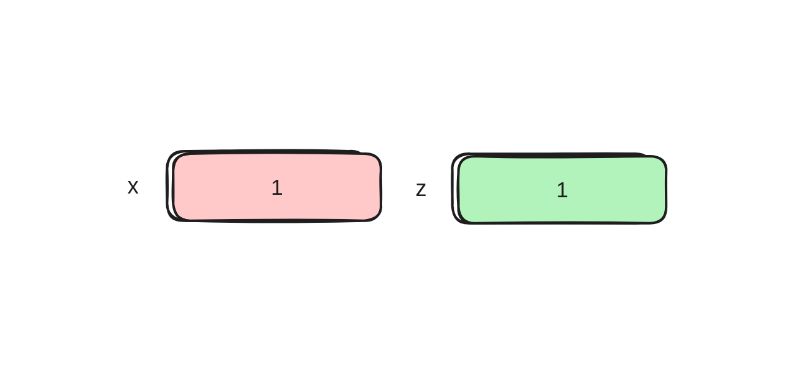
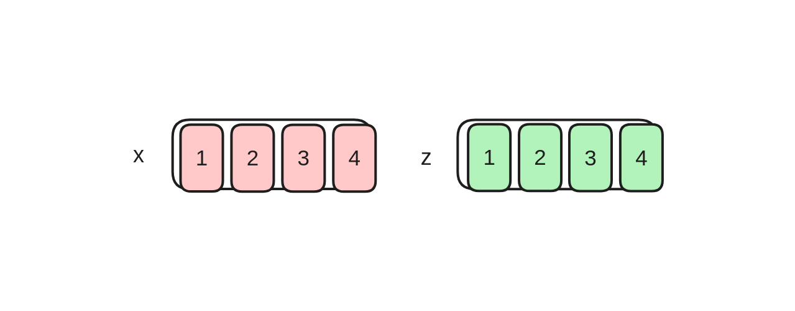
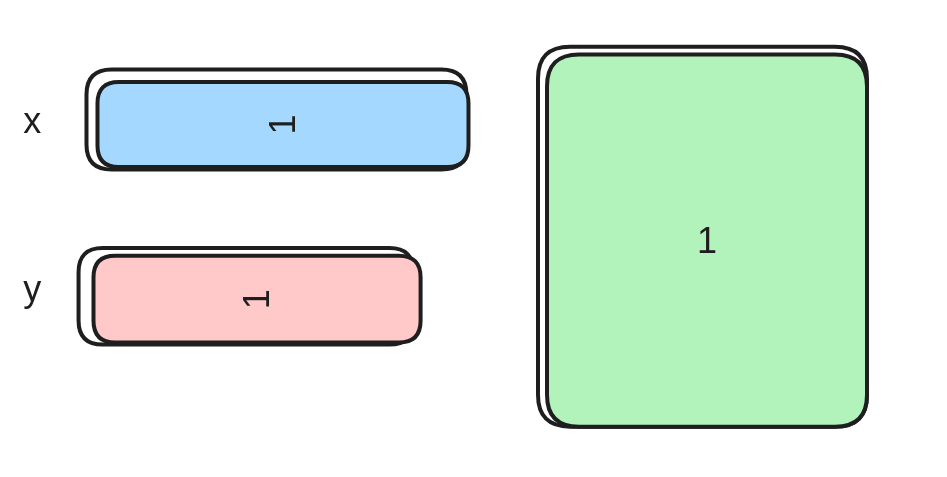
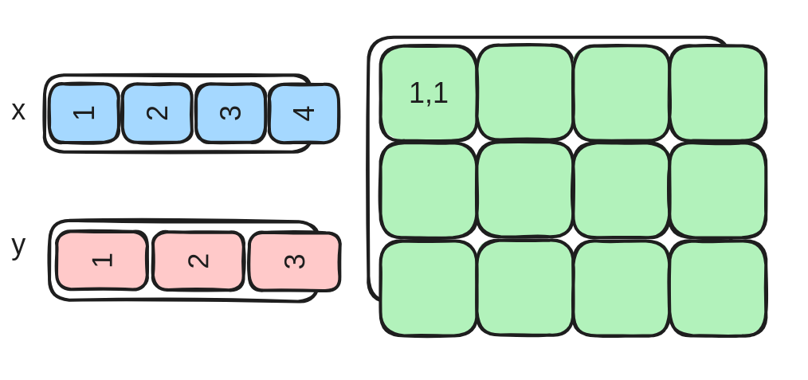
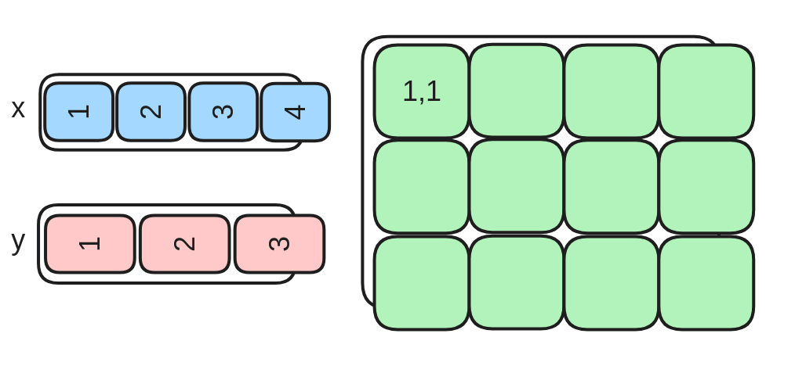
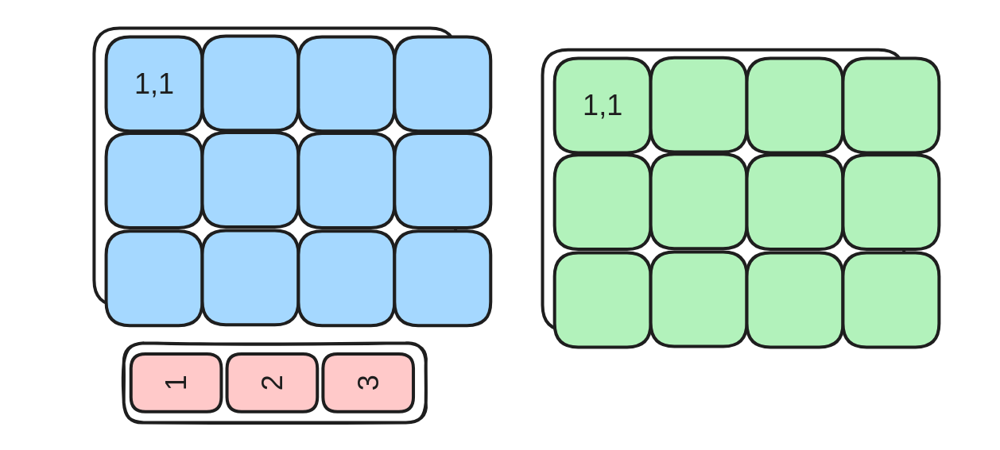
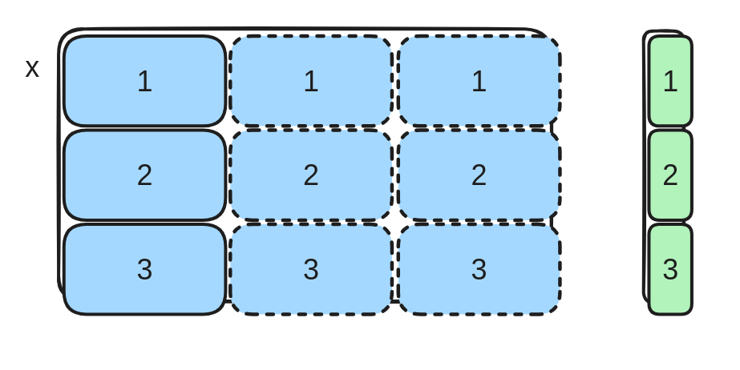
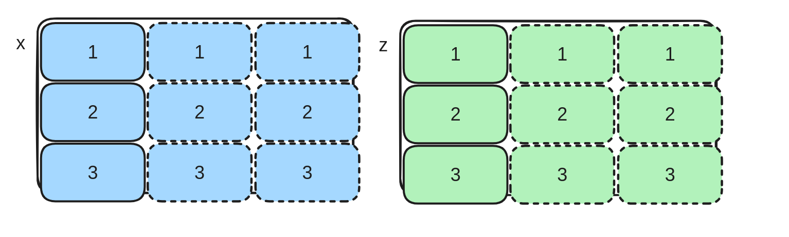
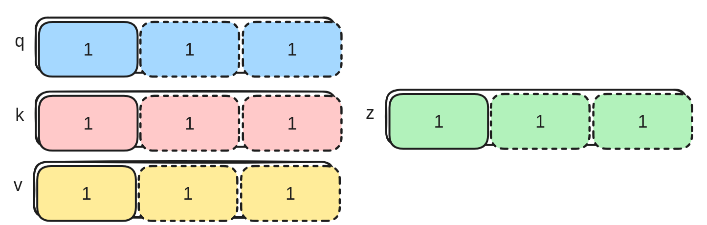

# Homework 1 — Triton Warm‑ups (Oct 04 → Oct 25)

---

## Contents
- [Tasks](#tasks)
  - [Task 1 — Constant Add](#task-1--constant-add)
  - [Task 2 — Constant Add (Block)](#task-2--constant-add-block)
  - [Task 3 — Outer Vector Add](#task-3--outer-vector-add)
  - [Task 4 — Outer Vector Add (Block)](#task-4--outer-vector-add-block)
  - [Task 5 — Fused Outer Multiplication + ReLU](#task-5--fused-outer-multiplication--relu)
  - [Task 6 — Fused Outer Multiplication: Backward](#task-6--fused-outer-multiplication-backward)
  - [Task 7 — Long Sum](#task-7--long-sum)
  - [Task 8 — Long Softmax](#task-8--long-softmax)
  - [Task 9 — Simple FlashAttention (Scalar)](#task-9--simple-flashattention-scalar)

---

## Tasks

### Task 1 — Constant Add



**Problem:** Add a constant to a vector.  
**Formula:** `z[i] = const_val + x[i]` for `i = 0 … N-1`.  
**Grid:** one program **id** axis (`pid 0`).  
**Sizes:** `B0 == N` — one block covers the entire vector, **no mask needed**.

**Requirements:**
- use `tl.arange`, `tl.load`, `tl.store` without mask;
- solution must run on GPU (CUDA).

```python
import torch
import triton
import triton.language as tl


@triton.jit
def _add_const_kernel(x_ptr, z_ptr, const_val, N: tl.constexpr):
    # YOUR CODE HERE


def add_triton(x: torch.Tensor, const_val: int) -> torch.Tensor:
    assert x.is_cuda, 'Tensor must be on GPU (CUDA).'
    N = x.numel()
    grid = (1,)
    z = torch.empty_like(x)
    _add_const_kernel[grid](x, z, const_val, N)
    return z
```

---

### Task 2 — Constant Add (Block)



**Problem:** Add a constant to a vector.  
**Formula:** `z[i] = const_val + x[i]` for `i = 0 … N-1`.  
**Grid:** one **block** axis (`pid 0`).  
**Sizes:** `B0 < N` — blocks process the vector in chunks, **mask required** on the tail.

**Requirements:**
- use `tl.arange`, `tl.load`, `tl.store` with mask (`mask = offs < N`);
- solution must run on GPU (CUDA).

```python
import torch
import triton
import triton.language as tl


@triton.jit
def _add_const_block_kernel(x_ptr, z_ptr, const_val, N: tl.constexpr, B0: tl.constexpr):
    # YOUR CODE HERE


def add_block_triton(x: torch.Tensor, const_val: int) -> torch.Tensor:
    assert x.is_cuda, 'Tensor must be on GPU (CUDA).'
    N = x.numel()
    B0 = 128
    grid = ((N + B0 - 1) // B0,)
    z = torch.empty_like(x)
    _add_const_block_kernel[grid](x, z, const_val, N, B0)
    return z
```

---

### Task 3 — Outer Vector Add



**Problem:** Add two vectors to form an outer sum matrix.  
**Formula:** `z[i, j] = x[j] + y[i]` for `i = 0 … N1-1`, `j = 0 … N0-1`.  
**Grid:** one program block axis; `B0 == N0`, `B1 == N1` — **no masking needed**.

**Requirements:**
- use `tl.arange`, `tl.load`, `tl.store`;
- solution must run on GPU (CUDA).

```python
import torch
import triton
import triton.language as tl


@triton.jit
def _outer_add_kernel(x_ptr, y_ptr, z_ptr, N0: tl.constexpr, N1: tl.constexpr):
    # YOUR CODE HERE


def outer_vector_add_triton(x: torch.Tensor, y: torch.Tensor) -> torch.Tensor:
    # YOUR CODE HERE
```

---

### Task 4 — Outer Vector Add (Block)



**Problem:** Add a row vector to a column vector.  
**Formula:** `z[i, j] = x[j] + y[i]` for `i = 0 … N1-1`, `j = 0 … N0-1`.  
**Grid:** **two program block axes** `(pid1, pid0)`.  
**Sizes:** `B0 < N0`, `B1 < N1` — **masking on both axes**.

**Requirements:**
- use `tl.arange`, `tl.load`, `tl.store`;
- solution must run on GPU (CUDA).

```python
import torch
import triton
import triton.language as tl


@triton.jit
def _outer_add_block_kernel(x_ptr, y_ptr, z_ptr, N0, N1, B0: tl.constexpr, B1: tl.constexpr):
    # YOUR CODE HERE


def add_vec_block_triton(x: torch.Tensor, y: torch.Tensor) -> torch.Tensor:
    # YOUR CODE HERE
```

---

### Task 5 — Fused Outer Multiplication + ReLU



**Problem:** Multiply a row vector with a column vector and apply ReLU.  
**Formula:** `z[i, j] = max(0, x[j] * y[i])` for `i = 0 … N1-1`, `j = 0 … N0-1`.  
**Grid:** two program block axes `(pid1, pid0)`.  
**Sizes:** `B0 < N0`, `B1 < N1` — **masking on both axes**.

**Requirements:**
- use `tl.arange`, `tl.load`, `tl.store`, and `tl.maximum` for ReLU;
- solution must run on GPU (CUDA).

```python
import torch
import triton
import triton.language as tl


@triton.jit
def _mul_relu_block_kernel(x_ptr, y_ptr, z_ptr, N0, N1, B0: tl.constexpr, B1: tl.constexpr):
    # YOUR CODE HERE


def mul_relu_block_triton(x: torch.Tensor, y: torch.Tensor) -> torch.Tensor:
    # YOUR CODE HERE
```

---

### Task 6 — Fused Outer Multiplication: Backward



**Problem:** Backward of `z = relu(x[None, :] * y[:, None])` w.r.t. `x`, given upstream gradient `dz (N1, N0)`.  
**Formula:** `dx[j] = sum_i 1[x[j]*y[i] > 0] * y[i] * dz[i, j]`.  
**Grid:** two program block axes `(pid1, pid0)`, `B0 < N0`, `B1 < N1` — **masking on both axes**.

**Requirements:**
- use `tl.arange`, `tl.load`, `tl.store`, `tl.where`;
- accumulate partial sums and write to `dx` via `tl.atomic_add`;
- solution must run on GPU (CUDA).

```python
import torch
import triton
import triton.language as tl


@triton.jit
def _mul_relu_block_back_kernel(x_ptr, y_ptr, dz_ptr, dx_ptr, N0, N1, B0: tl.constexpr, B1: tl.constexpr):
    # YOUR CODE HERE


def mul_relu_block_back_triton(x: torch.Tensor, y: torch.Tensor, dz: torch.Tensor) -> torch.Tensor:
    # YOUR CODE HERE
```

---

### Task 7 — Long Sum



**Problem:** Sum each **row** of a 2D tensor `x` of shape `(N0, T)`.  
**Formula:** `out[i] = sum_{j=0}^{T-1} x[i, j]` for `i = 0 … N0-1`.  
**Grid:** one program block axis (`pid0` iterates over rows). Process `T` using inner tiles `B1 < T` (loop over tiles).

**Requirements:**
- use a loop over tiles of length `B1` with mask for the tail block;
- accumulate a running sum in `acc` and store to `out[row]` after the loop;
- solution must run on GPU (CUDA).

```python
import torch
import triton
import triton.language as tl


@triton.jit
def _long_sum_kernel(x_ptr, out_ptr, N0, T, B1: tl.constexpr):
    # YOUR CODE HERE


def sum_triton(x: torch.Tensor) -> torch.Tensor:
    # YOUR CODE HERE
```

---

### Task 8 — Long Softmax



**Problem:** Row‑wise softmax over logits `x` of shape `(N0, T)`.  
**Formula:**
```
row_max = max_j x[i, j]
row_exp = exp(x[i, j] - row_max)
out[i, j] = row_exp / sum_k row_exp
```
**Grid:** one program block axis (`pid0` iterates over rows). Process `T` using tiles `B1 < T`.

**Requirements:**
- use tiles of length `B1` with masks for tail blocks;
- first pass: compute `row_max`; second pass: compute sum of exponents; third pass: normalize and store;
- use `exp2(x * log2(e))` instead of `exp(x)` for stability and speed;
- solution must run on GPU (CUDA).

**Advanced:** You can do it in **2 loops** by simultaneously updating a running sum with renormalization when the running max increases (see the FlashAttention trick below).

```python
import torch
import triton
import triton.language as tl


@triton.jit
def _long_softmax_kernel(x_ptr, out_ptr, N0, T, B1: tl.constexpr):
    # YOUR CODE HERE


def softmax_triton(x: torch.Tensor) -> torch.Tensor:
    # YOUR CODE HERE
```

---

### Task 9 — Simple FlashAttention (Scalar)



**Problem:** A scalar (single‑head) FlashAttention: given query `q (T,)`, keys `k (T,)`, values `v (T,)`, compute softmax over `q·k_j` and return the weighted sum of `v`.  
**Formula:**
```
s_j = q * k[j]
soft = softmax(s)
res = sum_j soft[j] * v[j]
```
**Grid:** process the sequence in tiles `B1 < T` (a single program streams all tiles).

**Requirements:**
- use the running‑max / renormalization trick in **1 loop**:
  ```
  m_new = max(m, s_j)
  l     = l * 2**(m - m_new) + 2**(s_j - m_new)
  acc   = acc * 2**(m - m_new) + v_j * 2**(s_j - m_new)
  m     = m_new
  ```
- result = `acc / l`.

```python
import torch
import triton
import triton.language as tl


@triton.jit
def _flashatt_kernel(q_ptr, k_ptr, v_ptr, out_ptr, T, B1: tl.constexpr, LOG2E: tl.constexpr):
    # YOUR CODE HERE


def flashatt_triton(q: torch.Tensor, k: torch.Tensor, v: torch.Tensor) -> torch.Tensor:
    # YOUR CODE HERE
```


